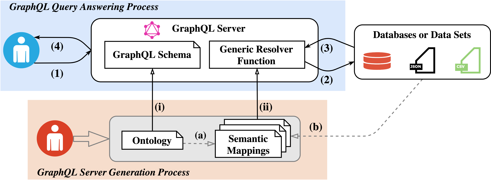
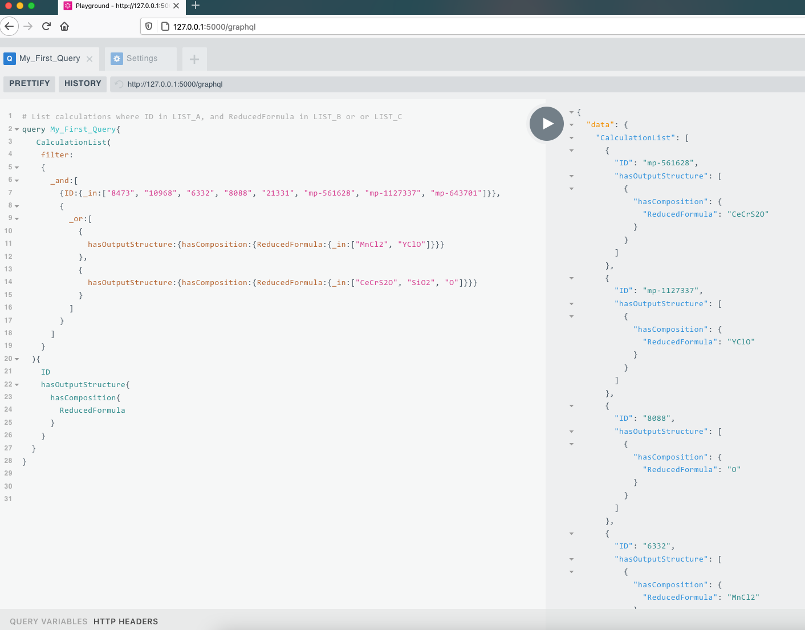

# OBG-gen: Ontology-Based GraphQL Server Generation for Data Access and Integration
A framework for using GraphQL in which a global domain ontology drives the generation of a GraphQL server that answers requests by querying the integrated data sources. The core of this framework contains an algorithm to generate a GraphQL schema based on an ontology, and a generic GraphQL resolver function as a library based on semantic mappings. 

## The Framework of OBG-gen for Data Access and Integration

* (i): Ontology-based GraphQL schema generation
* (ii): Semantic mappings-based GraphQL resolvers generation

## Getting Started

* [schema_generator/graphql_schema_gen.py](schema_generator/graphql_schema_gen.py) takes an ontology as the input and then outputs a GraphQL schema.
* [mapping_parser/mapping_parser.py](mapping_parser/mapping_parser.py) takes a RML mappings file (in turtle format) as the input and then outputs mappings and logical sources into a json file.
* [app.py](./app.py) is used to set up the GraphQL server using [Ariadne](https://ariadnegraphql.org).

## Installation (tested with python version 3.9)

* Following packages are needed and successfully installed messages are shown:

[//]: # "python -m pip install \"graphql-core>=3\""
[//]: # "GraphQL-core 3 can be installed from PyPI using the built-in pip command:"
	
	
    pip install ariadne
    pip install Flask
    pip install requests
    pip install pandas
    pip install sqlalchemy
    pip install sympy
    pip install PyMySQL
    pip install rdflib
    
    Successfully installed anyio-3.4.0 ariadne-0.14.0 graphql-core-3.1.6 idna-3.3 sniffio-1.2.0 starlette-0.17.1 typing-extensions-4.0.1
    Successfully installed Flask-2.0.2 Jinja2-3.0.3 MarkupSafe-2.0.1 Werkzeug-2.0.2 click-8.0.3 itsdangerous-2.0.1
    Successfully installed charset-normalizer-2.0.8 requests-2.26.0 urllib3-1.26.7
    Successfully installed numpy-1.21.4 pandas-1.3.4 python-dateutil-2.8.2 pytz-2021.3 six-1.16.0
    Successfully installed greenlet-1.1.2 sqlalchemy-1.4.27
    Successfully installed mpmath-1.2.1 sympy-1.9
    Successfully installed PyMySQL-1.0.2
    Successfully installed isodate-0.6.0 pyparsing-3.0.6 rdflib-6.0.2

## Usage
**Pre-Step (i)**: Generate GraphQL schema from an ontology and output _**(*)-schema.graphql**_ and _**(*)2graphql.json**_ files in current folder.

	python ./schema_generator/graphql_schema_gen.py ./schema_generator/mdo.ttl

**Pre-Step (ii)**: Parse a RML mappings file and output the _**(*).json**_ file in current folder.

	python ./mapping_parser/mapping_parser.py ./mapping_parser/semantic_mappings/mdo-mappings-mysql-1K.ttl

**Step 1**: Run GraphQL server.

[//]: # "export FLASK_ENV=development"

    python app.py ./schema_generator/mdo-schema.graphql ./schema_generator/mdo2graphql.json ./mapping_parser/mdo-mappings-mysql-1K.json 

	* Serving Flask app "app" (lazy loading)
	* Environment: development
	* Debug mode: on
	* Running on http://127.0.0.1:5000/ (Press CTRL+C to quit)
	* Restarting with stat
	* Debugger is active!
	* Debugger PIN: 540-041-748

Then the GraphQL server can be accessed via http://127.0.0.1:5000/graphql as shown below.

*You don't have to re-run **Pre-Step (i)** and/or **Pre-Step (ii)** if you have not changed your ontology and/or RML mappings.*

## Evaluation

You can find more details regarding the evaluation of the framework in [this folder](evaluation/README.md).
