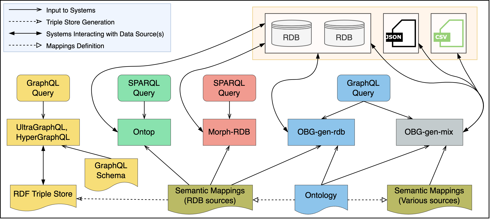

### Evaluation Workflow


### Real Case Evaluation

* An example query without filter expression is shown below. (List all structures including reduced formula.)
```
    {
        StructureList{
            hasComposition{
                ReducedFormula
            }
        }
    }
```

* An example query with filter expression is shown below. (List all calculations including ID, output calculated property name and value, where ID in a given list of values.)
``` 
    {
      CalculationList(
        filter: { ID: { _in: ["6332", "8088", "21331", "mp-561628", "mp-614918"] } }
      ) {
        ID
        hasOutputCalculatedProperty {
          PropertyName
          numericalValue
        }
      }
    }
```

* You can find all the 12 GraphQL queries at [this folder](./materials_design_domain/OBG-gen).
    * [Q1](./materials_design_domain/OBG-gen/query1.graphql) (List all the structures containing the reduced formula of each structure's composition.)
    * [Q2](./materials_design_domain/OBG-gen/query2.graphql) (List all the calculations containing the reduced formula of each output structure's composition.)
    * [Q3](./materials_design_domain/OBG-gen/query3.graphql) (List all the calculations containing the name and value of each output calculated property.)
    * [Q4](./materials_design_domain/OBG-gen/query4.graphql) List all the calculations containing the name and value of each output calculated property, the reduced formula of each output structure's composition.)
    * [Q5](./materials_design_domain/OBG-gen/query5.graphql) (List all the calculations and structures)
    * [Q6](./materials_design_domain/OBG-gen/query6.graphql) (List all the calculations where the ID is in a given list of values.)
    * [Q7](./materials_design_domain/OBG-gen/query7.graphql) (List all the calculations where the ID is in a given list of values, and the reduced formula is in a given list of values.)
    * [Q8](./materials_design_domain/OBG-gen/query8.graphql) (List all the calculations where the ID is in a given list of values, and the reduced formula is in a given list A or B.)
    * [Q9](./materials_design_domain/OBG-gen/query9.graphql) (List all the calculations where the value of band gap property is higher than 5.)
    * [Q10](./materials_design_domain/OBG-gen/query10.graphql) (List all the calculations where the value of band gap property is higher than 5, and the reduced formula in a given list of values.)
    * [Q11](./materials_design_domain/OBG-gen/query11.graphql) (List all the calculations where the filter condition is complex that needs to be simplified.)
    * [Q12](./materials_design_domain/OBG-gen/query12.graphql) (List all the structures that contain Si element.)


* Query Execution Time (QET) per data size on materials dataset.

* Query Execution Time (QET) per query on materials dataset.


### Synthetic Evaluation

* An example query is shown below.
```
    { 
      UniversityList (filter:{nr:{_eq:973}}) { 
        undergraduateDegreeObtainedBystudent{ 
          advisor { 
            worksFor{nr} 
          } 
        } 
      } 
    } 
```
* You can find all the 8 query sets and data at [this folder](./university_domain_LinGBM). More details regarding these query templates can be found at [LinGBM repo](https://github.com/LiUGraphQL/LinGBM/wiki/Query-Templates-of-the-Benchmark).
    * [QS1](./university_domain_LinGBM/QT1) (QT1)
    * [QS2](./university_domain_LinGBM/QT2) (QT2)
    * [QS3](./university_domain_LinGBM/QT3) (QT3)
    * [QS4](./university_domain_LinGBM/QT4) (QT4)
    * [QS5](./university_domain_LinGBM/QT5) (QT5)
    * [QS6](./university_domain_LinGBM/QT6) (QT6)
    * [QS7](./university_domain_LinGBM/QT10) (QT10)
    * [QS8](./university_domain_LinGBM/QT11) (QT11)

* Experimental examples for the real case evaluation and the evaluation based on LinGBM.
    * [real case evaluation](./materials_design_domain/)
    * [evaluation based on LinGBM](./university_domain_LinGBM)