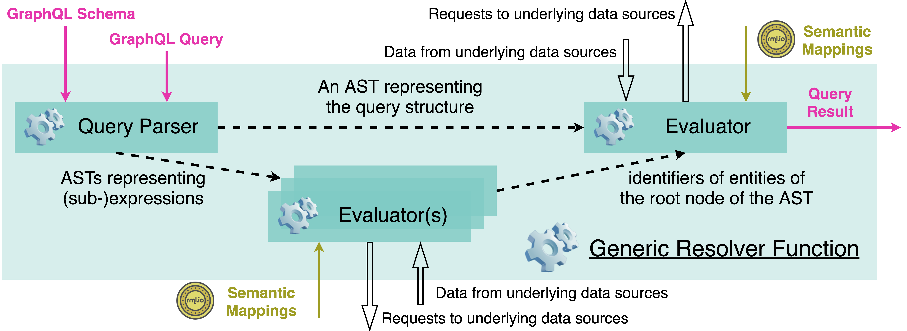
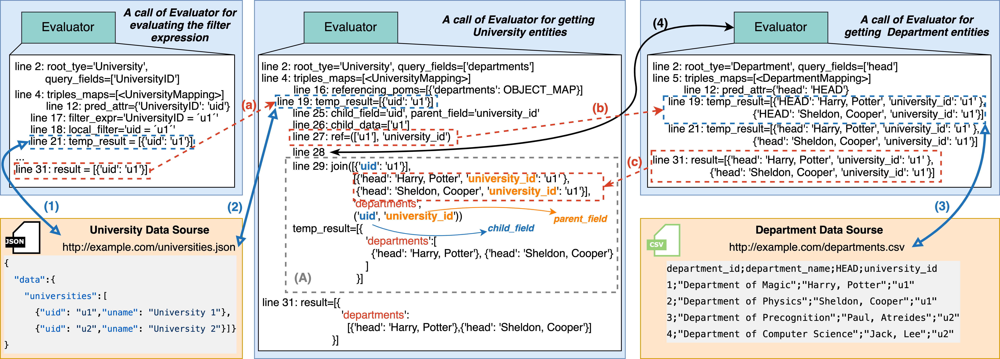

## Getting Started

*  [obg_gen_graphql_utils.py](./obg_gen_graphql_utils.py) defines helper functions used to generating the generic resolver function;    
*  [mapping_utils.py](./mapping_utils.py) defines the helper functions used to read parsed RML mappings;
*  [filter_utils.py](./filter_utils.py) defines the helper functions used parse filtering conditions;
*  [filter_ast.py](./filter_ast.py) is used to define the abstract syntax tree to represent filtering conditions entailed with a GraphQL query.

## Technical Components


## Example for Answering the query



* Example query (Get the university including the head of each department where the UniversityID is `u1').
```
    { 
        UniversityList(
          filter:{
            UniversityID:{
            _eq:"u1"}
          }){ 
          departments{
            head
          }
        } 
    } 
```


  

